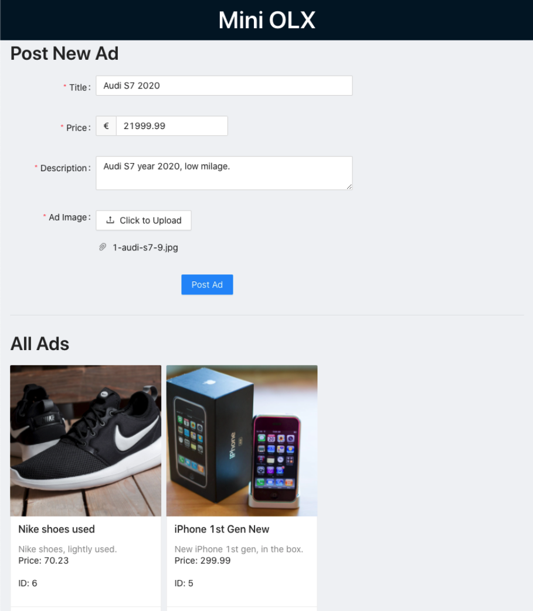

# OLX Women Workshop - Frontend

## Requirements

- [Node v13+](https://nodejs.org/en/)
- NPM v6.14+ (Automatically installed with Node)
- [Docker (Desktop for Mac/Windows, Engine for Linux)](https://www.docker.com/get-started)
- Your terminal of choice
- Your favorite text editor, we recommend [VS Code](https://code.visualstudio.com) for this workshop

# Development

## Initial Setup

We'll start by using [Create React App](https://reactjs.org/docs/create-a-new-react-app.html#create-react-app) to quickly bootstrap our single-page application:

```sh
npx create-react-app mini-olx-frontend
```

and move to the newly created folder

```sh
cd mini-olx-frontend
```

At the root of the project, let's create a `.env` file to hold our project variables. This will come in hand later. You can read more about it [here](- https://create-react-app.dev/docs/adding-custom-environment-variables/#adding-development-environment-variables-in-env).

```sh
REACT_APP_API_BASE="http://localhost:4040"
```

Now run

```sh
npm start
```

and you can see your application running at [http://localhost:3000/](http://localhost:3000/).


## First steps

### Clean up

1. Let's clean the React boilerplate in `App.js`.

```diff
-import logo from './logo.svg';
import './App.css';

// rest of the code ...

  return (
    <div className="App">
      <header className="App-header">
+        <h1>Mini OLX</h1>
-        
-        <p>
-          Edit <code>src/App.js</code> and save to reload.
-        </p>
-        <a
-          className="App-link"
-          href="https://reactjs.org"
-          target="_blank"
-          rel="noopener noreferrer"
-        >
-          Learn React
-        </a>
      </header>
    </div>
```

2. and let's also clean up the `App.css` file and remove the styles we don't need and add some new.

```diff
.App {
+  max-width: 1200px;
+  padding: 0 16px 16px 16px;
+  margin: auto;
-  text-align: center;
}

- .App-logo {
-   height: 40vmin;
-   pointer-events: none;
- }
-
-@media (prefers-reduced-motion: no-preference) {
-  .App-logo {
-    animation: App-logo-spin infinite 20s linear;
-  }
-}
-
.App-header {
+  text-align: center;
-  background-color: #282c34;
-  min-height: 100vh;
-  display: flex;
-  flex-direction: column;
-  align-items: center;
-  justify-content: center;
-  font-size: calc(10px + 2vmin);
-  color: white;
}
-
-.App-link {
-  color: #61dafb;
-}
-
-@keyframes App-logo-spin {
-  from {
-    transform: rotate(0deg);
-  }
-  to {
-    transform: rotate(360deg);
-  }
-}
```

### New configuration and Dockerfile

1. Let's also create a configuration file to be used later by our project. Create a new folder under `src/` called `config` and inside it create a new file called `index.js` with the following content:

```js
const config = {
  api_ads: `${process.env.REACT_APP_API_BASE}/api/ads`,
};

export default config;
```

2. Next, we'll create a configuration to be able to run our project on Docker alongside our backend. For that, first, in the root of your project, create a document called `Dockerfile` (no extension) with the following content:

```docker
FROM node:16.3.0-alpine

WORKDIR /app

# Install app dependencies
# A wildcard is used to ensure both package.json AND
# package-lock.json are copied where available (npm@5+)
COPY package*.json ./

RUN npm install

# Bundle app source
COPY . .

EXPOSE 3000

CMD ["npm", "start"]
```

3. And next, create also in the root folder, create a new file called `docker-compose.yml` and add the following content:

```yml
version: "3.2"
services:
  frontend:
    build:
      context: .
      dockerfile: ./Dockerfile
    ports:
      - 3000:3000
    volumes:
      - ".:/app"
    env_file: .env
    container_name: mini-olx-frontend

  database:
    image: mysql:5.7.22
    environment:
      MYSQL_ROOT_PASSWORD: ""
      MYSQL_ALLOW_EMPTY_PASSWORD: 1
    container_name: mini-olx-db
    ports:
      - 33061:3306
    volumes:
      - mini-olx-data:/var/lib/mysql

  backend:
    image: aipms/projects:mini-olx-backend
    depends_on:
      - database
    environment:
      WAIT_HOSTS: database:3306
    ports:
      - 4040:4040
    container_name: mini-olx-backend

volumes:
  mini-olx-data:
```

Your folder structure now should be looking something like this:

```sh
.
├── node_modules
├── src
│   ├── setupTests.js
│   ├── reportWebVitals.js
│   ├── logo.svg
│   ├── index.js
│   ├── index.css
│   ├── config
│   │   └── index.js
│   ├── App.test.js
│   ├── App.js
│   └── App.css
├── public
│   ├── robots.txt
│   ├── manifest.json
│   ├── logo512.png
│   ├── logo192.png
│   ├── index.html
│   └── favicon.ico
├── package.json
├── package-lock.json
├── docker-compose.yml
├── README.md
└── Dockerfile
```

4. Now let's run our project from Docker. If you still had your previous `npm start` running, close it (`ctr/cmd + c` in the terminal). Next, run:

```sh
docker-compose up
```

Wait for the dependencies to load and your page should be looking something like this:


## Posting Form

Now it is time to create our posting form.

1. In the `src/` folder, let's create a folder called `components` and inside it another one called `PostingForm`. Inside the last one, create 2 documents: `PostingForm.jsx` and `PostingForm.css`. Your folder structure now should looks like this:

```diff
 .
 ├── node_modules
 ├── src
 │   ├── setupTests.js
 │   ├── reportWebVitals.js
 │   ├── logo.svg
 │   ├── index.js
 │   ├── index.css
 │   ├── config
 │   │   └── index.js
+│   ├── components
+│   │   └── PostingForm
+│   │       ├── PostingForm.jsx
+│   │       └── PostingForm.css
 │   ├── App.test.js
 │   ├── App.js
 │   └── App.css
 ├── public
 │   ├── robots.txt
 │   ├── manifest.json
 │   ├── logo512.png
 │   ├── logo192.png
 │   ├── index.html
 │   └── favicon.ico
 ├── package.json
 ├── package-lock.json
 ├── docker-compose.yml
 ├── README.md
 └── Dockerfile
```

2. Now, on `PostingForm.jsx` add the following content:

```jsx
import React, { useRef } from "react";
import config from "../../config";
import "./PostingForm.css";

const PostingForm = (props) => {
  const { onPostAd = () => {} } = props;
  const formRef = useRef(null);

  const handleOnSubmit = (e) => {
    e.preventDefault();
    const data = new FormData(e.target);

    fetch(config.api_ads, {
      method: "POST",
      body: data,
    })
      .then((res) => res.json())
      .then((response) => {
        onPostAd();
        formRef.current.reset();
      })
      .catch(console.error);
  };

  return (
    <form onSubmit={handleOnSubmit} className="form__posting" ref={formRef}>
      <h2>Post New Ad</h2>
      <label htmlFor="title">
        Title:
        <input id="title" name="title" type="text" required />
      </label>
      <label htmlFor="price">
        Price:
        <input id="price" type="number" name="price" step="0.01" required />
      </label>
      <label htmlFor="description">
        Description:
        <textarea id="description" name="description" required />
      </label>
      <label htmlFor="ad_image">
        Image:
        <input id="ad_image" name="ad_image" type="file" required />
      </label>
      <button type="submit">Post</button>
    </form>
  );
};

export default PostingForm;
```

3. And on `PostingForm.css` add:

```css
.form__posting label {
  display: block;
  margin-top: 8px;
}

.form__posting button {
  margin: 8px 0;
}
```

And finally, let's add our Posting Form to our page:

```diff
import "./App.css"
+import PostingForm from "./components/PostingForm/PostingForm";

function App() {

  return (
    <div className="App">
      <header className="App-header">
        <h1>Mini OLX</h1>
      </header>
+      <main>
+        <PostingForm />
+      </main>
    </div>
  );
}
```

Now it should be looking something like this 👇. Try posting some ads!


## Ads listing

Next, we need to show all the ads we have created so far. Let's start by creating an `Ads` component to display all of our ads.

1. Create a new folder under `src/components` called `Ads`. Inside it, create a file called `Ads.jsx` and another called `Ads.css`.

Your folder structure now should be looking something like this:

```diff
  .
  ├── node_modules
  ├── src
  │   ├── setupTests.js
  │   ├── reportWebVitals.js
  │   ├── logo.svg
  │   ├── index.js
  │   ├── index.css
  │   ├── config
  │   │   └── index.js
  │   ├── components
  │   │   ├── PostingForm
  │   │   │   ├── PostingForm.jsx
  │   │   │   └── PostingForm.css
+ │   │   └── Ads
+ │   │       ├── Ads.jsx
+ │   │       └── Ads.css
  │   ├── App.test.js
  │   ├── App.js
  │   └── App.css
  ├── public
  │   ├── robots.txt
  │   ├── manifest.json
  │   ├── logo512.png
  │   ├── logo192.png
  │   ├── index.html
  │   └── favicon.ico
  ├── package.json
  ├── package-lock.json
  ├── docker-compose.yml
  ├── README.md
  └── Dockerfile
```

2. To start improving our UI, we're going to add an external library called [Ant Design](https://ant.design) to our project. Install it running:

```sh
npm install antd @ant-design/icons
```

3. Add the following on top of the `App.css` file to import Ant's css styles:

```diff
+@import "~antd/dist/antd.css";

.App {
  max-width: 1200px;
  padding: 0 16px 16px;
  margin: auto;
}

.App-header {
  text-align: center;
}
```

4. Finally, let's create our ads listing. Add the following to `Ads.jsx`:

```jsx
import React from "react";
import { Card } from "antd";
import { DeleteFilled } from "@ant-design/icons";
import "./Ads.css";

const { Meta } = Card;

const Ads = (props) => {
  const { ads = [], onDeleteAd = () => {} } = props;

  return (
    <>
      <h2>All Ads</h2>

      <ul className="list__ads">
        {ads?.map((ad) => {
          return (
            <li key={ad.id}>
              <Card
                style={{ width: 240 }}
                cover={
                  ad.ad_image ?  : null
                }
                actions={[
                  <DeleteFilled
                    key={"delete-ad"}
                    onClick={() => onDeleteAd(ad.id)}
                  />,
                ]}
              >
                <Meta title={ad.title} description={ad.description} />
                <p>Price: {ad.price}</p>
                <p>ID: {ad.id}</p>
              </Card>
            </li>
          );
        })}
      </ul>
    </>
  );
};

export default Ads;
```

5. Add the following styles to `Ads.css`:

```css
.list__ads {
  list-style: none;
  padding: 0;
  margin: 0;
}

.list__ads > li {
  margin-bottom: 16px;
}
```

6. Finally, on `App.js` let's add our `Ads` component to the page. Let's also add a function to fetch our ads from the backend and another one to delete an ad:

```diff
import "./App.css";
+import { useState, useEffect } from "react";
import PostingForm from "./components/PostingForm/PostingForm";
+import Ads from "./components/Ads/Ads";

function App() {
+  const [ads, setAds] = useState([]);
+
+  const fetchAllAds = () => {
+    fetch(config.api_ads)
+      .then((res) => res.json())
+      .then((response) => setAds(response.data))
+      .catch((err) => console.error(err));
+  };
+
+  const handleOnDelete = (adId) => {
+    if (!adId) {
+      return;
+    }
+    fetch(`${config.api_ads}/${adId}`, { method: "DELETE" })
+      .then((res) => res.json())
+      .then((response) => fetchAllAds())
+      .catch((err) => console.error(err));
+  };

+
+  useEffect(() => {
+    fetchAllAds();
+  }, []);

  return (
    <div className="App">
      <header className="App-header">
        <h1>Mini OLX</h1>
      </header>
      <main>
        <PostingForm />
+       <hr />
+       <Ads ads={ads} onDeleteAd={handleOnDelete}/>
      </main>
    </div>
  );
}
```

7. It would also be nice to update the ads available in the listing after posting a new ad. So let's do that by adding a `handleonPostAd()` to be called on new ads are posted. Add the following to `App.js`:

```diff
import "./App.css";
import { useState, useEffect } from "react";
import PostingForm from "./components/PostingForm/PostingForm";
import Ads from "./components/Ads/Ads";
import config from "./config";

function App() {
  const [ads, setAds] = useState([]);

  const fetchAllAds = () => {
    fetch(config.api_ads)
      .then((res) => res.json())
      .then((response) => setAds(response.data))
      .catch((err) => console.error(err));
  };

  const handleOnDelete = (adId) => {
    if (!adId) {
      return;
    }
    fetch(`${config.api_ads}/${adId}`, { method: "DELETE" })
      .then((res) => res.json())
      .then((response) => fetchAllAds())
      .catch((err) => console.error(err));
  };


  useEffect(() => {
    fetchAllAds();
  }, []);

+ const handleOnPostAd = () => {
+   fetchAllAds();
+ };

  return (
    <div className="App">
      <header className="App-header">
        <h1>Mini OLX</h1>
      </header>
      <main>
+       <PostingForm onPostAd={handleOnPostAd} />
        <hr />
        <Ads ads={ads} onDeleteAd={handleOnDelete} />
      </main>
    </div>
  );
}
```

Now your page should be looking something like this and is fully functional!


If you've reached here, congratulations! You have a working single-page application! 🎉

# Make the page pretty

Our SPA is functional but it is also super ugly at this point! Let's use Ant Design and make it prettier!

## Page Layout

Let's start by adjusting the page layout styles in `App.js`.

1. Do the following changes to `App.js`

```diff
import "./App.css";
import { useState, useEffect } from "react";
import PostingForm from "./components/PostingForm/PostingForm";
import Ads from "./components/Ads/Ads";
import config from "./config";
+import { Divider } from "antd";
+import Title from "antd/lib/typography/Title";
+import Layout, { Content, Footer, Header } from "antd/lib/layout/layout";

function App() {
  const [ads, setAds] = useState([]);

  const fetchAllAds = () => {
    fetch(config.api_ads)
      .then((res) => res.json())
      .then((response) => setAds(response.data))
      .catch((err) => console.error(err));
  };

  const handleOnDelete = (adId) => {
    if (!adId) {
      return;
    }
    fetch(`${config.api_ads}/${adId}`, { method: "DELETE" })
      .then((res) => res.json())
      .then((response) => fetchAllAds())
      .catch((err) => console.error(err));
  };


  useEffect(() => {
    fetchAllAds();
  }, []);
  const handleOnPostAd = () => {
    fetchAllAds();
  };

  return (
+    <Layout>
+      <Header>
+        <Title className="header__title">Mini OLX</Title>
+      </Header>
+      <Content>
+        <div className="App">
-          <header className="App-header"></header>
           <main>
             <PostingForm onPostAd={handleOnPostAd} />
-            <hr />
+            <Divider />
             <Ads ads={ads} onDeleteAd={handleOnDelete} />
           </main>
+        </div>
+      </Content>
+      <Footer>YOUR_NAME @ OLX Workshop ©2022</Footer>
+    </Layout>
  );
}
```

2. Add the following styles to `App.css`:

```diff
@import "~antd/dist/antd.css";

.App {
  max-width: 1200px;
  padding: 0 16px 16px;
  margin: auto;
}

.App-header {
  text-align: center;
}

+h1.header__title {
+  text-align: center;
+  color: white;
+  margin: 8px 0;
+}
```

Now your page should be starting to shape up better:

<!-- TODO SCREENSHOT LAYOUT -->

## Posting Form Layout

1. Change the following on Posting Form to start using form elements from Ant Design. We'll also update how we post our ad to follow the callback signature from `<Form/>` from Ant:

```diff
+import { UploadOutlined } from "@ant-design/icons";
+import { Button, Form, Input, InputNumber, Upload } from "antd";
+import TextArea from "antd/lib/input/TextArea";
+import Title from "antd/lib/typography/Title";
import React, { useRef } from "react";
import config from "../../config";
import "./PostingForm.css";

const PostingForm = (props) => {
  const { onPostAd = () => {} } = props;
-  const formRef = useRef(null);
+  const [form] = Form.useForm();

+  const handleOnSubmit = (values) => {

-   e.preventDefault();
-   const data = new FormData(e.target);

+    const data = new FormData();
+    Object.entries(values).forEach(([key, value]) => {
+      data.append(key, value);
+    });

    fetch(config.api_ads, {
      method: "POST",
      body: data,
    })
      .then((res) => res.json())
      .then((response) => {
        onPostAd();
-       formRef.current.reset();
+       form.resetFields();
      })
      .catch(console.error);
  };

  return (
-    <form onSubmit={handleOnSubmit} className="form__posting" ref={formRef}>
-      <h2>Post New Ad</h2>
-      <label htmlFor="title">
-        Title:
-        <input id="title" name="title" type="text" />
-      </label>
-      <label htmlFor="price">
-        Price:
-        <input id="price" type="number" name="price" step="0.01" />
-      </label>
-      <label htmlFor="description">
-        Description:
-        <textarea id="description" name="description" />
-      </label>
-      <label htmlFor="ad_image">
-        Image:
-        <input id="ad_image" name="ad_image" type="file" />
-      </label>
-      <button type="submit">Post</button>
-    </form>

+    <Form
+      form={form}
+      onFinish={handleOnSubmit}
+      className="form__posting"
+      name="ad-post"
+      labelCol={{ span: 4 }}
+      wrapperCol={{ span: 12 }}
+    >
+      <Title level={2}>Post New Ad</Title>
+      <Form.Item
+        label="Title"
+        name="title"
+        rules={[{ required: true, message: "Please provide an Ad title" }]}
+      >
+        <Input minLength="10" />
+      </Form.Item>
+      <Form.Item
+        label="Price"
+        name="price"
+        rules={[{ required: true, message: "Please provide a Price" }]}
+      >
+        <InputNumber addonBefore="€" name="price" />
+      </Form.Item>
+      <Form.Item
+        label="Description"
+        name="description"
+        rules={[{ required: true, message: "Please provide a Description" }]}
+      >
+        <TextArea id="description" />
+      </Form.Item>
+      <Form.Item
+        label="Ad Image"
+        name="ad_image"
+        rules={[{ required: true, message: "Please provide an Image" }]}
+        getValueFromEvent={(e) => e.file.originFileObj}
+      >
+        <Upload
+          required
+          maxCount={1}
+          customRequest={({ onSuccess }) => onSuccess("ok")}
+        >
+          <Button icon={<UploadOutlined />}>Click to Upload</Button>
+        </Upload>
+      </Form.Item>
+
+      <Form.Item wrapperCol={{ offset: 8, span: 16 }}>
+        <Button type="primary" htmlType="submit">
+          Post Ad
+        </Button>
+      </Form.Item>
+    </Form>
  );
};

```

Now your Posting Form should be looking like this:


## Listing Layout

Finally, let's make our listing results more pretty.

1. Do the following changes to `Ads.css`:

```diff
.list__ads {
  list-style: none;
  padding: 0;
  margin: 0;
}
.list__ads > li {
  margin-bottom: 16px;
}

+.img__ad-card {
+  width: 240px;
+  height: 240px;
+  object-fit: cover;
+}
```

2. Do the following changes to `Ads.jsx` to improve its layout using Ant's components:

```diff
import React, { useEffect, useState } from "react";
+import { Button, Card, Dropdown, Menu, Space } from "antd";
+import Title from "antd/lib/typography/Title";
+import Layout from "antd/lib/layout/layout";
import { DeleteFilled, DownOutlined } from "@ant-design/icons";
import "./Ads.css";

const { Meta } = Card;

const Ads = (props) => {
  const { ads = [], onDeleteAd = () => {} } = props;

  return (
-    <>
-      <h2>All Ads</h2>

+    <Layout>
+      <Title level={2}>All Ads</Title>

      <ul className="list__ads">
+       <Space wrap>
          {ads?.map((ad) => {
            return (
              <li key={ad.id}>
                <Card
                  size="small"
                  style={{ width: 240 }}
                  cover={
                    ad.ad_image ? (
                      
                    ) : null
                  }
                  actions={[
                    <DeleteFilled
                      key={"delete-ad"}
                      onClick={() => onDeleteAd(ad.id)}
                    />,
                  ]}
                >
                  <Meta title={ad.title} description={ad.description} />
                  <p>Price: {ad.price}</p>
                  <p>ID: {ad.id}</p>
                </Card>
              </li>
            );
          })}
+       </Space>
      </ul>
    </Layout>
-    </>
  );
};
```

After all these changes, your page should be looking beautiful! ✨



---

# Next steps

Now enjoy your page! Maybe try to make it more your own and update the styles.

And get ready for the next workshop, where we'll be developing the Backend where all the information in this page is coming from!

Cya! 👋
